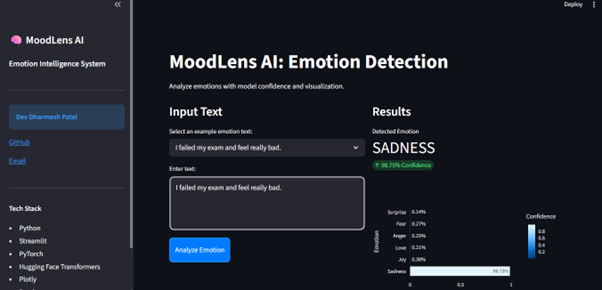
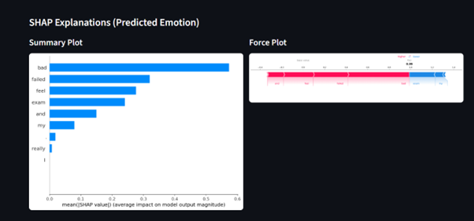

# MoodLens AI

Emotion intelligence web app for classifying text into six emotions using a fine-tuned RoBERTa model, with built-in explainability via SHAP.

**Developer:** [Dev Dharmesh Patel](https://github.com/devpatel0005)  
**Email:** [devdpatel0005@gmail.com](mailto:devdpatel0005@gmail.com)

## Overview
MoodLens AI predicts the emotional tone of user text across six classes:

- sadness
- joy
- love
- anger
- fear
- surprise

The project combines transformer-based inference with an interactive Streamlit UI and model explainability visualizations.

## Resume-Level Impact
- Built an end-to-end NLP application using a fine-tuned RoBERTa classifier for 6-class emotion detection.
- Developed a production-style Streamlit interface with real-time prediction, confidence scoring, and probability distribution charting.
- Integrated SHAP explainability into the UI to show token-level contribution for the **predicted emotion only**.
- Implemented both SHAP **Force Plot** and **Summary Plot** for interpretable model behavior analysis.
- Added robust label fallback logic to convert generic model outputs (for example, `LABEL_0`) into human-readable emotion names.
- Optimized app responsiveness using cached model loading and local model artifacts.

## Key Features
- Real-time emotion prediction from free-text input
- Confidence score and class-wise confidence visualization
- Example-text quick selection for faster testing
- SHAP Force Plot (predicted class only)
- SHAP Summary Plot (predicted class only)
- GPU-aware inference (uses CUDA when available)

## UI Screenshots

### 1. Main Dashboard and Prediction Results


### 2. SHAP Explanations (Summary Plot + Force Plot)


## Model Performance (Test Set)
| Emotion | Precision | Recall | F1-Score |
| :--- | :---: | :---: | :---: |
| Sadness | 0.97 | 0.98 | 0.97 |
| Joy | 0.95 | 0.96 | 0.95 |
| Love | 0.92 | 0.90 | 0.91 |
| Anger | 0.94 | 0.94 | 0.94 |
| Fear | 0.91 | 0.91 | 0.91 |
| Surprise | 0.89 | 0.85 | 0.87 |

## Tech Stack
- Python
- PyTorch
- Hugging Face Transformers
- Streamlit
- SHAP
- Plotly
- Pandas, NumPy, Matplotlib
- scikit-learn

## Project Architecture
1. User enters text in Streamlit UI.
2. Tokenizer preprocesses text for the RoBERTa classifier.
3. Model generates logits and softmax confidence scores.
4. UI displays:
	- predicted emotion and confidence
	- class-wise confidence bar chart
5. SHAP explainer computes token contributions.
6. UI renders predicted-class-only:
	- Summary Plot (left)
	- Force Plot (right)

## Quick Start
1. Clone repository:

```bash
git clone https://github.com/devpatel0005/MoodLens-AI.git
cd MoodLens-AI
```

2. Install dependencies:

```bash
python -m pip install -r requirements.txt
```

3. Run app:

```bash
streamlit run frontend/app.py
```

## Repository Structure
- `frontend/app.py` - Streamlit app, inference flow, SHAP visualizations
- `models/emotion_model/` - saved tokenizer and classifier weights
- `notebooks/Emotion_detection.ipynb` - model training and evaluation workflow
- `notebooks/shap.ipynb` - SHAP experimentation and interpretability analysis
- `datasets/emotion_predictions_full.csv` - development artifacts
- `requirements.txt` - Python dependencies

## Future Improvements
- Add confidence thresholding and low-confidence fallback messaging.
- Add input text cleaning and optional punctuation filtering for SHAP token display.
- Add model monitoring metrics and batch inference endpoint.

## License
This project is for educational and portfolio use.
